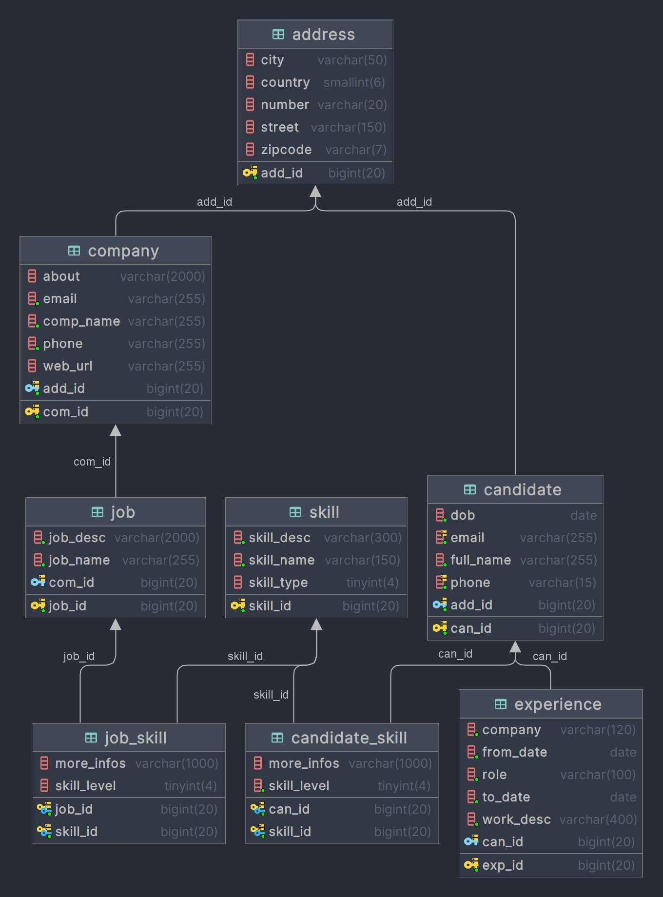
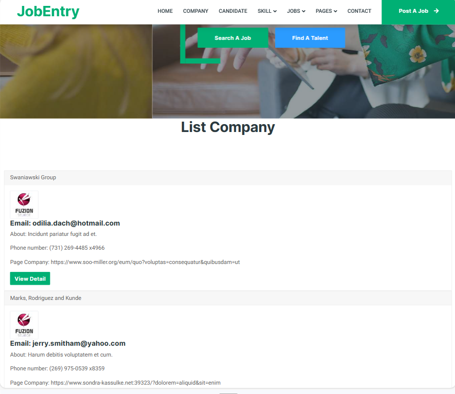
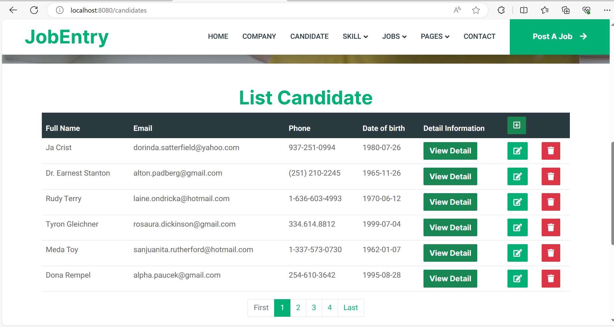
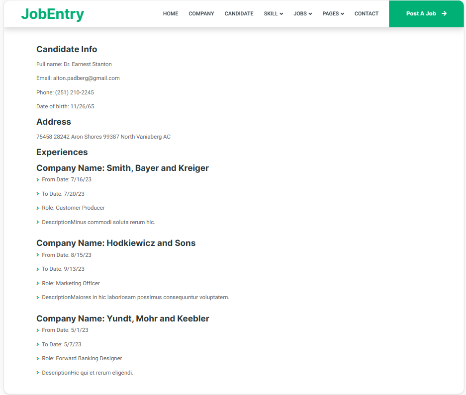
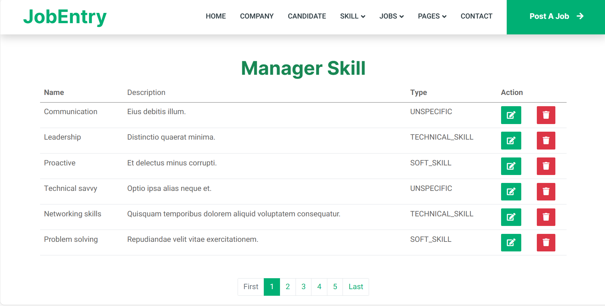
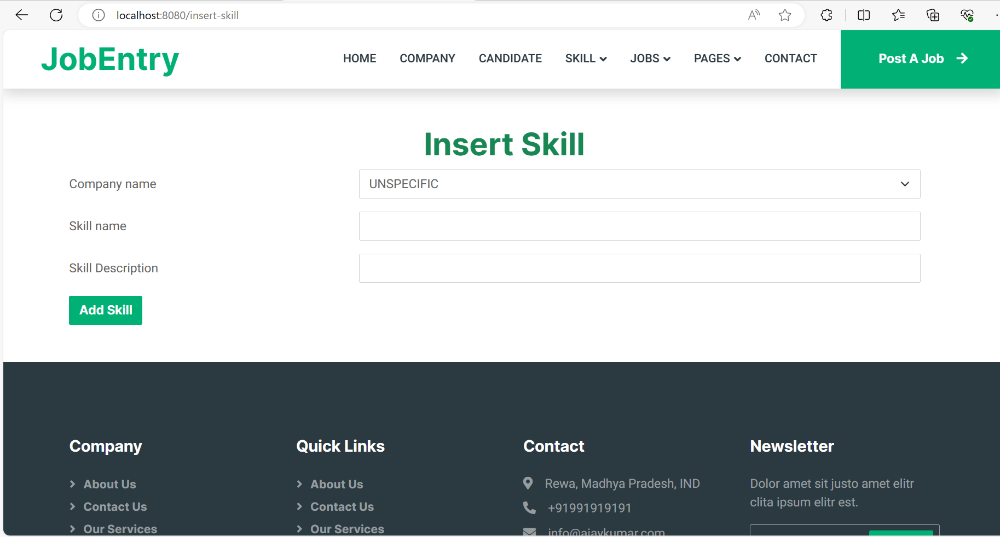
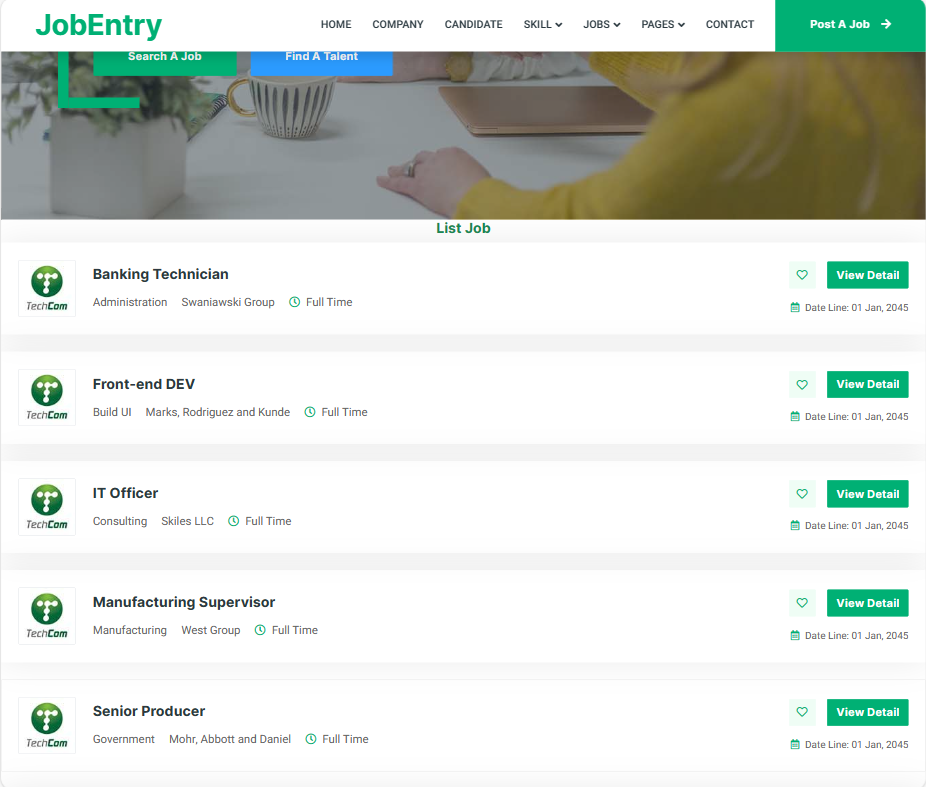
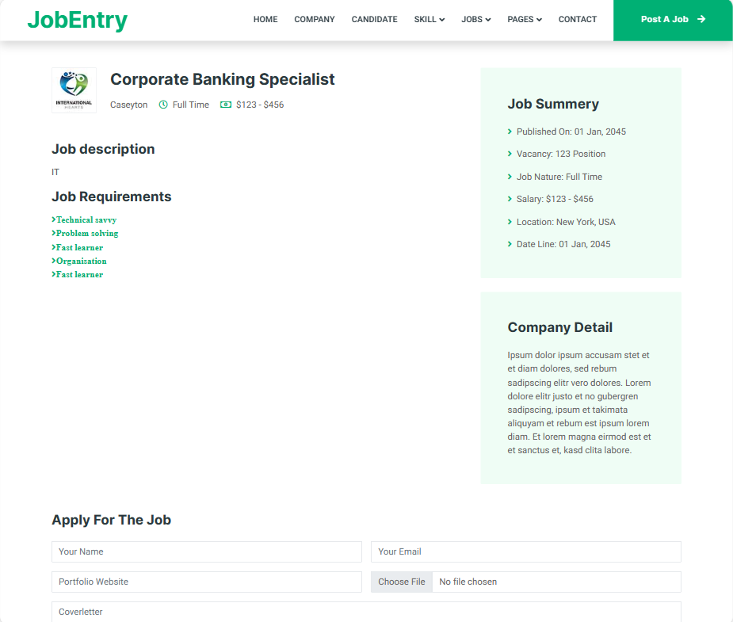
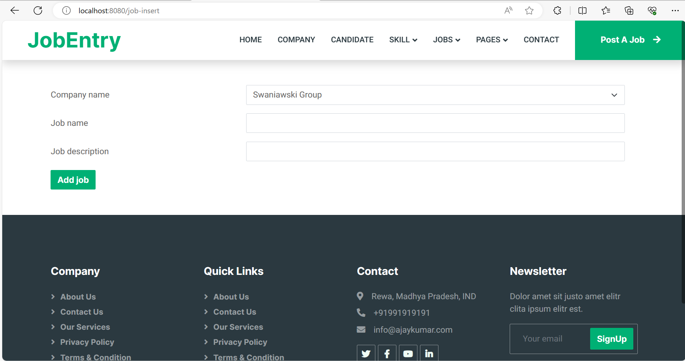

# WWW-NguyenVietBac-Lab5
# 💻 Công nghệ và công cụ sử dụng
     

### Giới thiệu chương trình
 Phần mềm quản lý tuyển dụng giúp người dùng và ứng viên dễ dàng trong việc tìm việc và phỏng vấn với 
 nhiều lựa chọn công việc theo kinh nghiệp và vị trí khác nhau

### Sơ đồ database của hệ thống

### Chức năng của hệ thống
- [Home Page](#)
- [Quản lý công ty](#add-candidate-page)
- [Quản lý ứng viên](#add-job-page)
- [Quản lý kỹ năng ](#manage-candidate-page)
- [Quản lý công việc ứng tuyển](#manage-job-page)

### Trang chủ của hệ thống

### Quản lý các công ty

### Quản lý ứng viên

### Quản lý kỹ năng 

# Quản lý các công việc đang ứng tuyển

